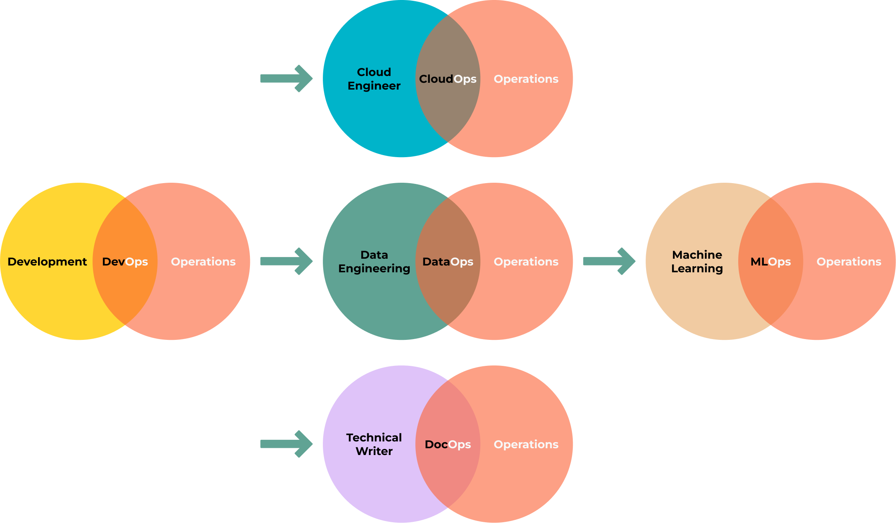
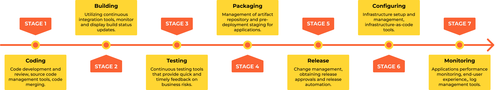

##########################
0.1 Introduction to DevOps
##########################

===============
What is DevOps?
===============

---------------------------------------------
"Explain Like I'm 5" (ELI5) version of DevOps
---------------------------------------------

*Imagine a restaurant. Developers are the chefs, they are making food, Operations Engineers are the waiters, they serve the food to the customers, the DevOps, and SREs are the guys that clean the floor, wash the vegetables, peel the potatoes, do all the jobs that are not glamourous but improve the process.*

.. image:: ../diagrams/devops-merge.png
   :width: 70%
   :align: center
   :alt: DevOps

**"DevOps is the union of people, process, and products to enable continuous delivery of value to our end users."** `DONOVAN BROWN <https://www.donovanbrown.com/post/what-is-devops>`_

.. note::

	*In a more technical sense, DevOps is a combination of "Development" and "Operations." It's a practice that brings together software developers and IT operations teams to collaborate more effectively, enabling them to create, test, and deploy software faster and more reliably. By using automation, continuous integration, and continuous delivery, DevOps helps reduce the time between writing code and getting it into the hands of users, improving overall software quality and user satisfaction.*

DevOps is based on several key principles, including:

	#. **Continuous Integration (CI)**: CI is a practice where developers regularly merge their code changes into a central repository, after which automated builds and tests are run. This helps to catch bugs early and improves the quality of the software.

	#. **Continuous Delivery (CD)**: CD is an extension of continuous integration. It involves automatically releasing the developer's changes from the repository to production, where it is ready to be deployed. This ensures that you can release new changes to your customers quickly and in a sustainable way.

	#. **Microservices**: Instead of creating a monolithic application, the application is divided into small, loosely coupled services. Each microservice can be developed, tested, deployed, scaled, and upgraded independently.

	#. **Infrastructure as Code (IaC)**: With IaC, system administrators can automatically manage and provision the technology stack for an application, rather than manually configuring each component. The infrastructure setup is written as code and can be versioned and reviewed in the same way the application code is.

	#. **Monitoring and Logging**: Monitoring and logging ensure system performance and prevent downtime. This includes both system-level monitoring and application-level monitoring.

	#. **Automation**: Automation is crucial in the DevOps methodology. This ranges from test and build automation to release automation, all aimed at reducing manual steps and thus reducing errors.

	#. **Collaboration and Communication**: Effective communication and collaboration between development, operations, and even wider business teams is a core principle of DevOps. By promoting better working relationships, businesses can deliver results more quickly and efficiently.

	#. **Fail fast and learn from failure**: A lean mindset of experimentation is essential for innovation. DevOps encourages failing fast and recovering even faster. When something fails, it's necessary to have the systems in place to prevent cascading failures and to recover without causing a significant impact on the service.

	#. **Security Integration (DevSecOps)**: Security should not be an afterthought. DevOps encourages the integration of security from the initial stages of development. This ensures that every part of the application is secure from the start.

	#. **Continuous Improvement**: DevOps is all about continuous improvement. Regular feedback loops and iterative improvement are vital. The aim is to constantly learn and improve the product and processes.

DevOps is not a specific role or job, it's more of a culture and a way of working. It requires close collaboration between developers, operations, and other teams involved in the software development process. It also requires the use of automation tools and technologies, such as containerization, configuration management, and continuous integration and delivery platforms.

DevOps is a **set of practices** that combines software Development (Dev) and IT operations (Ops). It aims to shorten the systems' development life cycle and provide continuous delivery with high software quality.

Overall, DevOps helps organizations to deliver software faster, with higher quality and reliability, while also reducing risks and improving the overall performance and security of the software.

It relies on **automation** (Python, Bash, Ansible, and Terraform) to enforce the best practices - deploy the code from git to the environment.

.. image:: ../diagrams/devops.png
   :width: 70%
   :align: center
   :alt: DevOps Stages

===========  ========================================================================  ======================================
Stages       What happens                                                              Tools used
===========  ========================================================================  ======================================
**Plan**     Decide what to do                                                         Azure Boards, Jira, focalboard
**Code**     Do                                                                        vscode, vim, emacs, intelij, eclipse
**Build**    Create a package/binary from the code we have written                     setup, poetry, maven, gradle, ant, sbt
**Test**     Check if the code is working, secure, performant, and reliable            pylint, pytest, mypy, behave, cucumber
**Release**  From all the builds decide what is a stable version                       GitHub Actions, Jenkins, Artifactory
**Deploy**   Install the stable version of the package on the environment              Ansible, Puppet, Chef, Terraform
**Operate**  Keep the application running                                              GCP, AWS, Azure
**Monitor**  Get information from the running system to see what needs to be improved  Grafana, Loki, Prometheus, Nagios
===========  ========================================================================  ======================================

====================================
What I do at work as DevOps Engineer
====================================

1. Support team with the infrastructure and automation they need to do their job: build new environments, create new pipelines, integrate tools, and improve the existing ones.
2. Improve our security, performance, reliability and scaling of our systems.
3. Help the team to improve their skills and knowledge.
4. Work on PoCs (Proof of Concepts) to test new technologies and tools and write ADRs(Architecture Decision Records) to document the decisions we make.
5. Manage our stakeholders and help them to understand the DevOps culture and how it can help them to achieve their goals.

===============================================
Site Reliability Engine(SRE) vs DevOps Engineer
===============================================

--------------------------------------------------
"Explain Like I'm 5" (ELI5) DevOps Engineer vs SRE
--------------------------------------------------

.. image:: ../diagrams/dev-vs-ops.png
   :width: 80%
   :align: center
   :alt: CI/CD

Imagine a play.

**DevOps** is like the group of people who write the script, direct the play, and also help with the stage setup and lighting. They're not just writing the lines (developing the software), they're also involved in making sure the play goes smoothly when it's showtime (deploying the software and maintaining the system it runs on). They're concerned with breaking down walls between the writing (development) and the production (operations) so that the play (software) can be created and performed more efficiently.

**SRE** (Site Reliability Engineering) on the other hand, is like a specialized team that ensures the play runs smoothly every night. They handle the lighting, and sound system, and fix any problems on the fly. They're responsible for making sure that the play can be performed consistently without disruptions (ensuring that the software runs reliably and scales to meet demand). They're the guardians of performance and uptime, using engineering and coding skills to automate tasks, solve problems, and create more efficient processes.

So, while DevOps focuses on streamlining the whole process of creating and deploying software, SRE focuses more specifically on ensuring that the software is reliable and performs well when it's running. There's a lot of overlap between the two, and many organizations use both practices together. In many ways, SRE can be seen as a specific implementation of the DevOps principles, with a special focus on reliability.

=============  ===============================================================================================================  ==============================================================================================================
Job Goals      SRE                                                                                                              DevOps
=============  ===============================================================================================================  ==============================================================================================================
Mission        Operations                                                                                                       Delivery
Works on       Incident response                                                                                                Release Automation
Improves       Post Mortem                                                                                                      Environment builds
Preparation    Monitoring, Events, Alerts                                                                                       configuration management
Increase       Capacity planning                                                                                                Infrastructure as a code
Primary focus  Reliability                                                                                                      Delivery Speed
Main role      Operational problems: production failures, infrastructure issues (disk, memory, network), security, monitoring.  Solve the development problems, and work on the CI/CD Pipeline - build, test, release, deploy
Technologies   Programming languages (Go, Java, Python), operating systems (Windows, Linux (Debian or Redhat based) ),          Scripting languages (Python, Go, Ruby, Bash), cloud platforms (AWS, Azure, GCP), containerization technologies   
_              distributed systems, and monitoring tools (Prometheus, Loki, Grafana).                                           (Docker, Kubernetes), and automation tools (Jenkins, Ansible, Puppet, Chef, Terraform).                          
=============  ===============================================================================================================  ==============================================================================================================

===============
DevOps flavours
===============

==============
CI/CD pipeline
==============

----------------------
Continuous integration
----------------------

	Is a DevOps software development practice where developers regularly merge their code changes into a central repository(usually git: GitLab, GitHub, Bitbucket, or Azure repo), after which automated builds and tests are run. Continuous integration most often refers to the build or integration stage of the software release process and entails both an automation component (e.g. a CI or build service) and a cultural component (e.g. learning to integrate frequently). The key goals of continuous integration are to find and address bugs quicker, improve software quality, and reduce the time it takes to validate and release new software updates.

-------------------
Continuous delivery
-------------------

	Is a software development practice where code changes are automatically prepared for a production release. A pillar of modern application development, continuous delivery expands upon continuous integration by deploying all code changes to a testing environment and/or a production environment after the build stage. When properly implemented, developers will always have a deployment-ready build artifact that has passed through a standardized test process.

CI/CD pipeline is a process to take the code to production, having usually 7 steps:

#. **Coding** - code development and review, source code management tools, code merging.
#. **Building** - continuous integration tools, build status.
#. **Testing** - continuous testing tools that provide quick and timely feedback on business risks.
#. **Packaging** - artifact repository, application pre-deployment staging.
#. **Releasing** - change management, release approvals, release automation.
#. **Configuring** - infrastructure configuration and management, infrastructure as code tools.
#. **Monitoring** -  applications performance monitoring, end-user experience.
