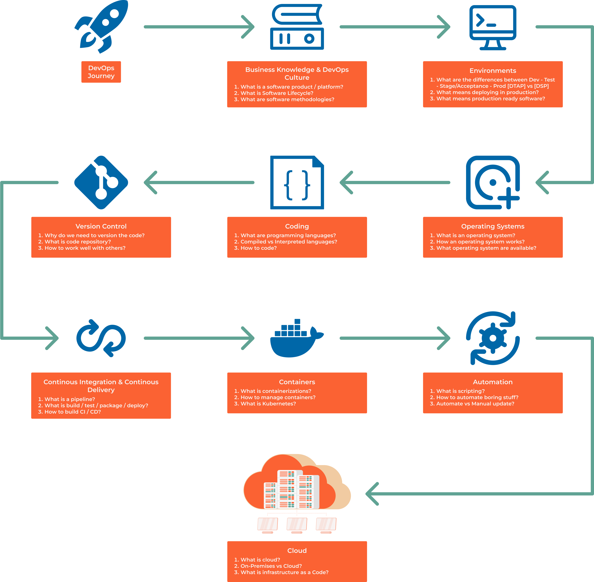

##################
0.2 DevOps Roadmap
##################

The DevOps position implies being able to work with a wide range of technologies and being able to quickly acquire new skills. This roadmap is a good starting point to learn the basics.

=============
Prerequisites
=============

There are some things you need to learn in order get better at it:

    1. How to work?
        - How to organize your work?
        - When something work? How to improve it?
        - When something doesn't work? How to fix it?

    2. How to learn?
        - There is limited time in our life? What to focus?
        - Trying out stuff

    3. How to communicate?
        - Information technology is a team sport, how to work with others?
        - How to get and give feedback?
        - How to ask for help?
        - How to say no?

    4. When to make a career change?

===================
Important Knowledge
===================

1. How stuff works? How code work? Where problems can occur?

2. Operating systems
    - Linux
    - Windows

3. Programming languages
    - Python
    - Go
    - Ruby

4. Networking and security
    - OSI Model
    - LAN and VPN
    - HTTP and HTTPS

5. Server and network management
    - Web servers vs Application servers

6. Databases
    - SQL vs NoSQL

7. Environments
    - BareMetal
    - Virtual Machines
    - Containers
    - Pods
    - Cloud

8. Orchestration and automation:
    - scripting: Powershell, Bash
    - configuration management: Ansible
    - container orchestration: Kubernetes, Docker
    - infrastructure as code: Terraform
    - CI/CD: Jenkins, Gitlab CI, GitHub Action

9. Monitoring

10. Software methodologies

==============
DevOps Roadmap
==============

But it's too much! Where to start? What to learn first? What to learn next?

1. Business Knowledge & DevOps culture
2. Environments
3. Operating systems
4. Coding
5. Git
6. CI/CD
7. Containers
8. Automation
9. Cloud

============
Course Goals
============

1. Get comfortable with ``terminal`` and ``Linux``
2. Learn ``how to code`` and find information
3. Learn how to ``work with others``
4. Get knowledge and ``best practices``
5. Build a ``portfolio`` and work on your resume
