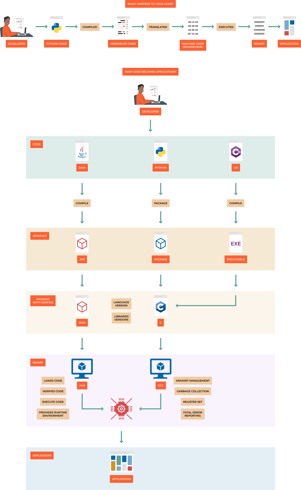
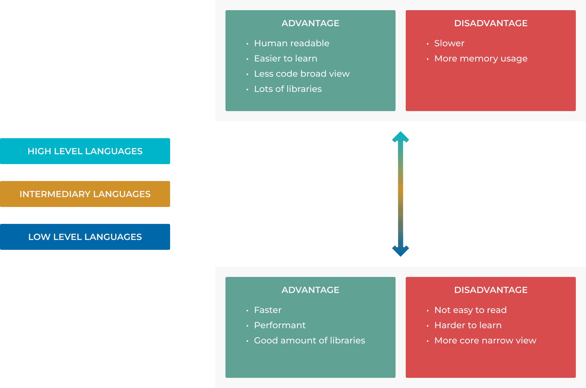

##################
1.1 How code works
##################

.. note::

    Code is a set of instructions that a computer can understand and execute. It is written in a programming language, such as Python, Java, C++, etc. These languages provide a set of rules and syntax that programmers use to write their code.

When a programmer writes code, they are essentially creating a set of instructions that the computer will follow to perform a specific task. For example, when a programmer writes code that tells a computer to display a message on the screen or to perform a calculation and return the result.

Once the code is written, it must be compiled or interpreted by a program called a compiler or interpreter. The compiler or interpreter takes the code written in the programming language and converts it into machine code, which is a set of instructions that the computer's processor can understand and execute.

When the code is executed, the computer follows the instructions in the code, line by line. It performs the tasks specified in the code, such as displaying a message, performing calculations, or interacting with other parts of the system.

The code also interacts with the computer's memory, where it stores and retrieves data. It also interacts with the computer's input and output devices, such as the keyboard, mouse, and screen, allowing the user to interact with the code and receive feedback from the code.

The source code is translated into assembly language.
The assembly code is translated into machine language.
The machine language is directly executed as binary code.

===========================================
High level languages vs low level languages
===========================================

High level language is a programming language that is designed to be easy for humans to read and write. It is also designed to be easy for computers to understand and execute. Examples of high level languages include Python, Java, Ruby, Go etc.

Low level language is a programming language that is designed to be easy for computers to understand and execute. It is also designed to be difficult for humans to read and write. Examples of low level languages include assembly language and machine language.
We classify C as low level language or better as intermediary language, because you have to do memory management, you have to clean up after yourself. "Garbage Collection" is when the system cleans up for you.

++++++
Python
++++++

.. code-block:: python

  print("Hello World")

++++++++++
C Language
++++++++++

.. code-block::

  #include <stdio.h>

  int main() {
      printf("Hello World");
      return 0;
  }

++++++++
Assembly
++++++++

.. code-block::

  global _start

  section .text

  _start:
    mov rax, 1        ; write(
    mov rdi, 1        ;   STDOUT_FILENO,
    mov rsi, msg      ;   "Hello World!\n",
    mov rdx, msglen   ;   sizeof("Hello World!\n")
    syscall           ; );

    mov rax, 60       ; exit(
    mov rdi, 0        ;   EXIT_SUCCESS
    syscall           ; );

  section .rodata
    msg: db "Hello World!", 10
    msglen: equ $ - msg

====================
In-memory vs on-disk
====================

.. note::

    In-memory data is stored in the computer's RAM, which is volatile. This means that when the computer is turned off, the data is lost. 
    On-disk data is stored on the computer's hard drive, which is non-volatile. This means that when the computer is turned off, the data is not lost.

If you're processing something too big you have to store it on disk. If you're processing something small you can store it in memory. 

If you can split a big file on disk into smaller chunks that fit in memory, you can process them in memory and then write the results back to disk, if not you need to stream the data from disk.

Serializing data is the process of converting it into a format that can be stored on disk or transmitted over a network. Deserializing data is the process of converting it back into its original format.

========================
Processing on CPU vs GPU
========================

.. note::

    The CPU is the central processing unit of a computer. It is responsible for executing instructions and performing calculations. The GPU is the graphics processing unit of a computer. It is responsible for rendering graphics and performing calculations related to graphics.

The CPU is a general-purpose processor that can perform a wide range of tasks. The GPU is a specialized processor that is designed to perform a specific task, such as rendering graphics or performing matrix operations.

The CPU is a serial processor, which means that it can only execute one instruction at a time. The GPU is a parallel processor, which means that it can execute multiple instructions at the same time.

The CPU is a high-performance processor that is designed to perform a wide range of tasks. The GPU is a low-performance processor that is designed to perform a specific task, such as rendering graphics or performing matrix operations.
