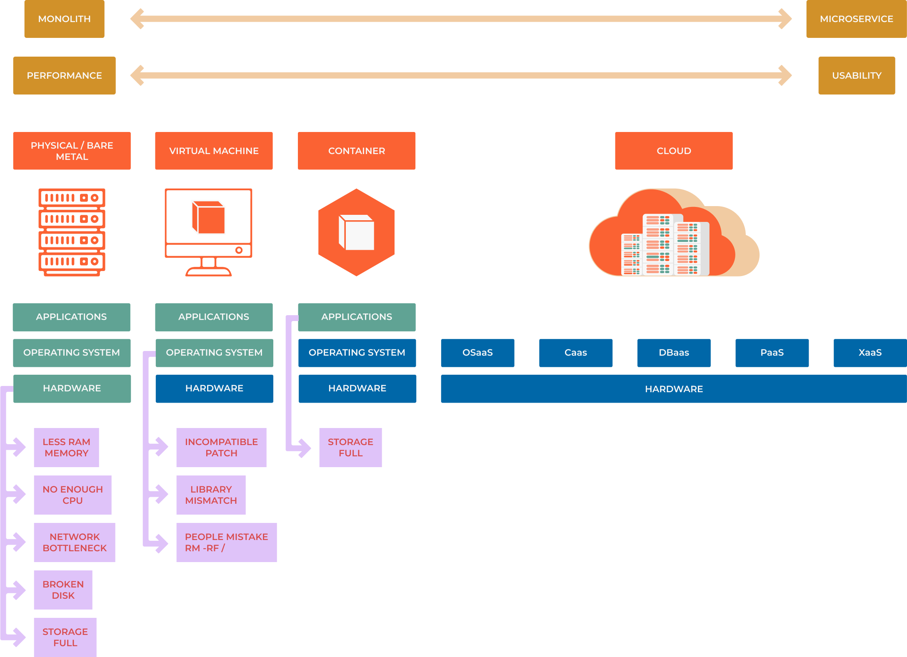

################
1.2 Environments
################

==========================================================
bare metal vs virtual machine vs container vs pod vs cloud
==========================================================

-----
What?
-----

    #. Bare metal (physical) refers to a physical server or computer that runs an operating system directly on the underlying hardware. It does not use virtualization or containerization technology. This allows for direct access to the hardware resources, but it also means that the server can only run one operating system and that the resources cannot be shared.

    #. Virtual machine (VM) refers to a software-based simulation of a computer system that runs on top of a physical host. A virtual machine allows multiple operating systems to run on the same physical server, each with its own set of resources. VMs are isolated from each other and the host, which allows for better security and resource management, but it also means that they require more resources than running on bare metal.

    #. Container refers to a lightweight, portable, and self-sufficient packaging of an application and its dependencies. Containers provide a consistent runtime environment, but they share the host operating system kernel, which makes them more lightweight and efficient than VMs. Containers are isolated from each other and the host, which allows for better security and resource management, but it also means that they require more resources than running on bare metal.

    #. Pod is a higher-level concept in container orchestration, it is a group of one or more containers deployed together on the same host and sharing the same network namespace. Pods allow multiple containers to share the same network and storage resources, and they can also be scheduled and managed together as a single unit.

    #. The cloud refers to a type of computing that delivers on-demand computing resources, services, and applications over the internet, it allows users to access and manage their resources remotely through the use of a web browser or API. Cloud services are usually provided by third-party providers like Amazon Web Services, Microsoft Azure, and Google Cloud Platform. Cloud services can be divided into three main categories: Infrastructure as a Service (IaaS), Platform as a Service (PaaS), and Software as a Service (SaaS).

In summary, Bare metal (physical) is a physical server or computer that runs an operating system directly on the underlying hardware, Virtual Machine (VM) is a software-based simulation of a computer system that runs on top of a physical host, Container is a lightweight, portable, and self-sufficient packaging of an application and its dependencies and Pod is a higher-level concept in container orchestration.
 
----
How?
----

===============  =========================================================================================================
Environment      
===============  =========================================================================================================
bare metal       1 data center, 1 physical machine, 1 OS, 1 Task 
virtual machine  1 data center, 1 physical machine, multiple virtual machines, multiple OS, multiple tasks
container        1 data center, multiple physical machines, multiple virtual machines, multiple OS, multiple tasks
cloud            multiple data centers, multiple physical machines, multiple virtual machines, multiple OS, multiple tasks
===============  =========================================================================================================

