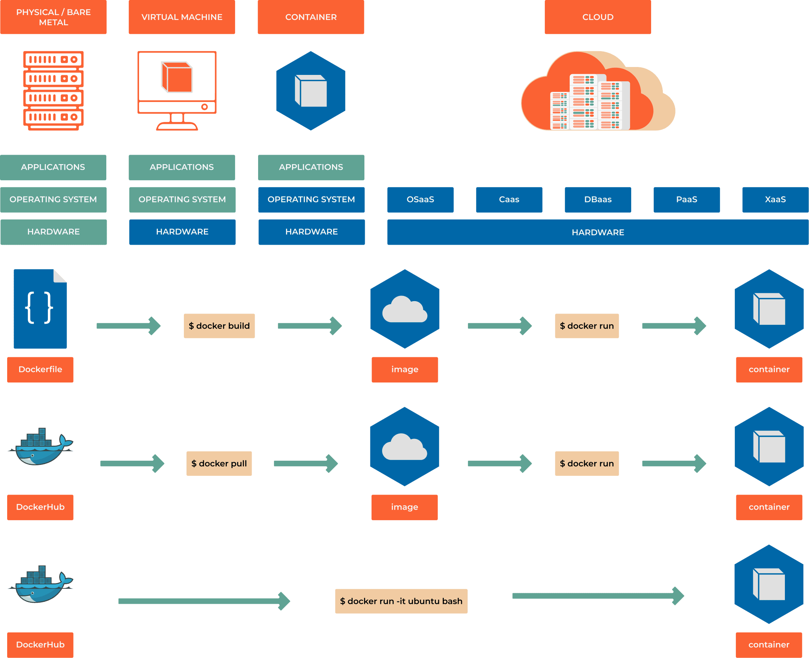

####################
8.4 Using Dockerfile
####################

===========
Hello world
===========

Create a file called ``Dockerfile`` where we will print 

.. code-block:: bash

    FROM alpine
    CMD ["echo", "Hell on World!"]

.. code-block:: bash
     
    # clone repository
    # change directory to docker_examples/hello_world
    # get location by running explorer.exe .
    # copy the location from explorer
    # change directory to the location

    # build the created image with a tag (-t) hello from current location (.)
    docker build -t hello .

    # instantiate a container based on created image using tag hello
    docker run hello

    # instantiate a container based on created image using tag hello and giving the container a name
    docker run --name HelloWorld hello

    # instantiate a container based on created image using tag hello and remove it after run(-rm)
    docker run --rm hello

=================
Deploy web server
=================

Create a file ``index.html``

.. code-block:: bash

    <!doctype html>
    <html lang="en">
    <head>
    <meta charset="utf-8">
    <title>Introduction to DevOps - Docker</title>
    
    </head>

    <body>
    <h1>Introduction to DevOps - Docker</h1>
    <h2>Web server deployed successfully!</h2>
    </body>
    </html>

And a file ``Dockerfile``

.. code-block:: bash

    FROM nginx:stable-alpine

    # Change our working directory to the root of nginx web host
    WORKDIR /usr/share/nginx/html

    # Copy in the the index.html
    COPY index.html /usr/share/nginx/html/

.. code-block:: bash
     
    # clone repository using git clone repo_url
    # change directory to docker_examples/hello_world
    # get location by running explorer.exe .
    # copy the location from explorer
    # change directory to the location

    docker build -t web_server .

    # build the created image with a tag (-t) hello from current location (.)
    docker container run -p 8080:80 --name web_server -d web_server

=====================
Building a Dockerfile
=====================

Before we construct our Dockerfile, you need to understand what makes up the file. This will be a text file, named Dockerfile, that includes specific keywords that dictate how to build a specific image. The specific keywords you can use in a file are:

    - **ADD** copies the files from a source on the host into the container's own filesystem at the set destination.
    - **ENV** sets environment variables.
    - **EXPOSE** associates a specific port to enable networking between the container and the outside world.
    - **FROM** defines the base image used to start the build process.
    - **USER** sets the UID (or username) which is to run the container.
    - **VOLUME** is used to enable access from the container to a directory on the host machine.
    - **WORKDIR** sets the path where the command, defined with CMD, is to be executed.
    - **LABEL** allows you to add a label to your docker image.
    - **RUN** - RUN instruction allows you to install your application and packages required for it. It executes any commands on top of the current image and creates a new layer by committing the results. Often you will find multiple RUN instructions in a Dockerfile.
    - **CMD** - can be used for executing a specific command within the container.CMD instruction allows you to set a default command, which will be executed only when you run container without specifying a command. If Docker container runs with a command, the default command will be ignored. If Dockerfile has more than one CMD instruction, all but last CMD instructions are ignored. The CMD can be overridden when starting a container with ``docker run image_name other_command`` example ``docker run fedora bash``.
    - **ENTRYPOINT** is also closely related to CMD and can modify the way a container is started from an image, sets a default application to be used every time a container is created with the image.

.. code-block:: bash

    FROM ubuntu:latest
    LABEL YOUR_NAME YOUR_EMAIL
    
    RUN apt-get -y update
    RUN apt-get -y upgrade
    RUN apt-get install -y tree

    CMD tree -d -L 2 /

to build the image we run ``docker build -t getting_tree .`` and to run docker ``docker run getting_tree``