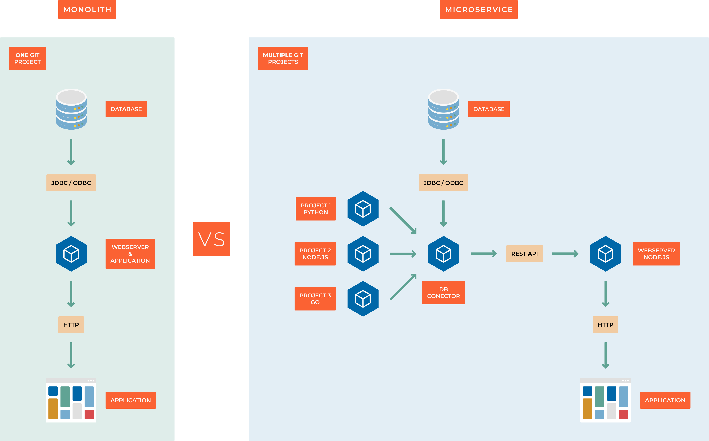
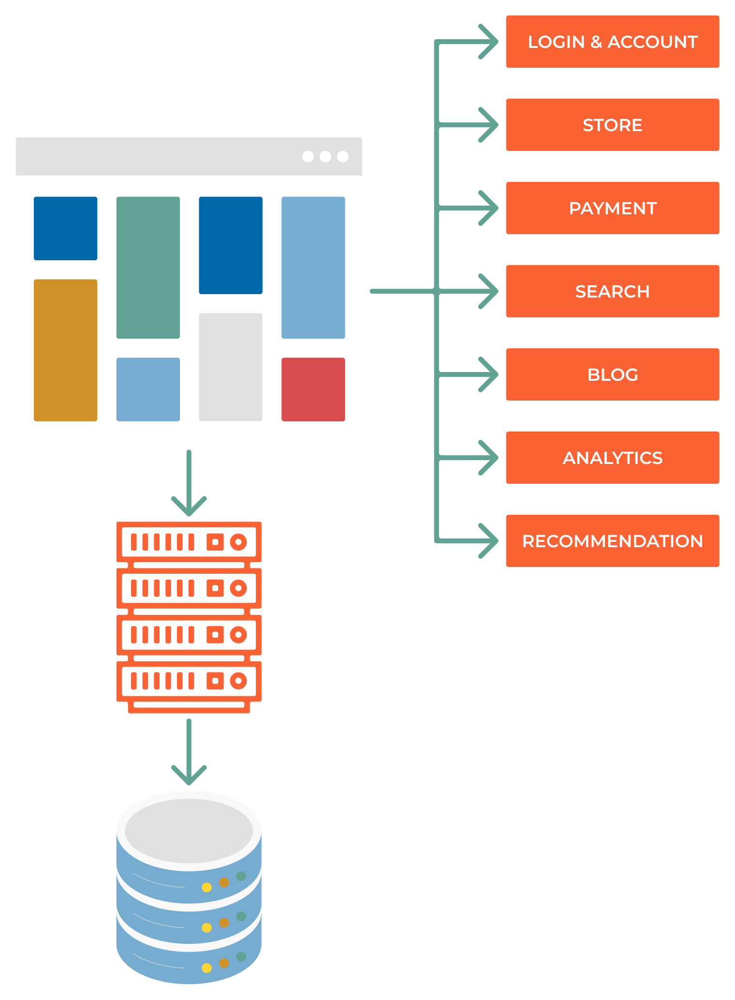

#############
9.00 Abstract
#############

========================================
Microservices vs Monolithic Architecture
========================================

++++++++++++++++++++++
What is Microservices?
++++++++++++++++++++++

A microservice is a small, autonomous service that works together with other services to form a larger application. Microservices are built around business capabilities and independently deployable by fully automated deployment machinery. There is a bare minimum of centralized management of these services, which may be written in different programming languages and use different data storage technologies.

+++++++++++++++++++
What is a Monolith?
+++++++++++++++++++

A monolithic application is built as a single and indivisible unit. Usually, such a monolith is built as a single executable file that contains all the program’s functionality. The monolithic application is self-contained and independent from other computing applications.

++++++++++++++++++++++++++++++
Feature vs layer decomposition
++++++++++++++++++++++++++++++

- **Vertical decomposition** - each service is responsible for a specific feature end-to-end, from the UI to the database
- **Horizontal decomposition** - each service is responsible for a specific layer of the application, such as the UI, the application logic, or the database

+++++++++++++++++++++++++++++++++++++++++++++++++
Rewriting everything vs incremental decomposition
+++++++++++++++++++++++++++++++++++++++++++++++++

1. **Rewrite everything** - Stopping development and focusing on rewriting the entire application from scratch. This is done when smaller parts of monolith lack the ability to scale, or when the monolith is too complex to be decomposed:

    1. Decompose the monolith into services
    2. Split the data store
    3. Decentralize all the things
    4. Asynchronous communication
    5. Automate all the things

2. **Incremental decomposition** - You're focusing on new features, while rewriting the monolith piece by piece.

    1. Define the boundaries of the new service
    2. Create a new service
    3. Create a new data store
    4. Integrate it with the monolith
    5. Decommission the old code if needed

====
TODO
====

We have this monolithic application, and we want to move to microservices. How do we do it?

+++++++++++++++++++++++
Problems to think about
+++++++++++++++++++++++

- Christmas is comming and we need to scale up our application
- Company decided that they want to outsource marketing to another company
- We want to start allowing users to pay in 12 installments and we need to get a banking license, we need to share date with regulators
- We want to deliver a mobile application
- We want to be able to track user behavior on our website
- We wrote everything in PHP and we want to migrate to better languages and frameworks