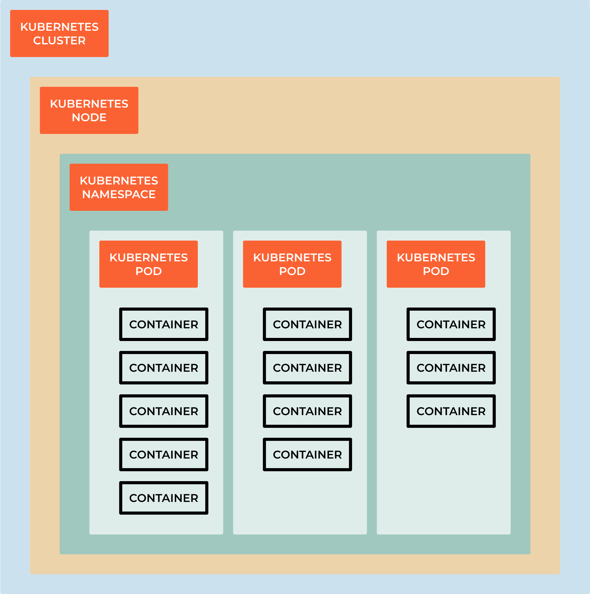

#########################
9.3 Creating a Deployment
#########################

.. note::

    A Kubernetes Deployment is a declarative way to manage the desired state of a group of containers. A Deployment defines the desired state of your application, including the number of replicas you want to run and the configuration of the containers.

The Deployment ensures that the desired state is always maintained, even if worker nodes in the cluster fail. If a node fails, the Deployment automatically replaces the containers running on that node with new containers on another node.

A Deployment also provides other benefits, such as rolling updates and rollbacks. A rolling update allows you to update your application without downtime, by gradually replacing old replicas with new ones. If there is an issue with the update, you can easily roll back to the previous version of your application.

To create a Deployment, you need to provide a YAML file that defines the desired state of your application, including the number of replicas, the image for the containers, and the desired state of the containers. You can then use the Kubernetes command line interface (CLI) to create the Deployment.

A Kubernetes Deployment is a powerful tool that provides a simple and reliable way to manage the desired state of your applications in a cluster, allowing you to easily scale, update, and manage your applications. 

Create a new file ``nginx-deployment.yaml``

.. code-block:: bash

    apiVersion: apps/v1
    kind: Deployment
    metadata:
        name: nginx-deployment
        namespace: nginx
        labels:
            app: nginx
    spec:
        replicas: 3
        selector:
            matchLabels:
                app: nginx
        template:
            metadata:
                labels:
                    app: nginx
            spec:
                containers:
                - name: nginx
                  image: nginx:1.14.2
                  ports:
                  - containerPort: 80

.. code-block:: bash

    kubectl apply -f nginx-deployment.yaml

.. code-block:: bash

    linux_user@linux_machine:~/sandbox $ kubectl get deployments
    NAME               READY   UP-TO-DATE   AVAILABLE   AGE
    nginx-deployment   3/3     3            3           4m14s

Find out more:
.. code-block:: bash

    kubectl describe deployments

Updating running deployments

.. code-block:: bash

    kubectl set image deployment/nginx-deployment nginx=nginx:1.16.1
    # or 
    kubectl edit deployment/nginx-deployment

    # Roll the update
    kubectl rollout status deployment/nginx-deployment

======================
What means everything?
======================

A Kubernetes Deployment is a resource object in Kubernetes that provides a declarative way to manage and update applications. It ensures that a specified number of replicas of your application are running and handles updates and rollbacks of your application with minimal disruption. Here's an explanation of the key components and structure of a Kubernetes Deployment:

++++++++++
apiVersion
++++++++++

.. code-block:: bash

    apiVersion: apps/v1

apiVersion is the version of the Kubernetes API that you're using to create this object. This is required and should be the first line in the YAML file.

++++
kind
++++

.. code-block:: bash

    kind: Deployment

kind is the type of object you want to create, there are:

#. **Pod**: ``kind: Pod`` indicates that the manifest defines a Pod, which is the smallest deployable unit in Kubernetes. Pods can contain one or more containers that share the same network namespace.

#. **Service**: ``kind: Service`` indicates that the manifest defines a Service, which provides networking and load balancing to a set of Pods. Services are used to expose applications within or outside the cluster.

#. **Deployment**: ``kind: Deployment`` indicates that the manifest defines a Deployment resource, which is used to manage the deployment and scaling of Pods. Deployments are often used to ensure that a specified number of replica Pods are running.

#. **ConfigMap**: ``kind: ConfigMap`` represents a ConfigMap resource that holds configuration data in key-value pairs, which can be mounted into Pods as volumes or used as environment variables.

#. **Secret**: ``kind: Secret`` represents a Secret resource used to store sensitive information, such as passwords or API keys, securely within the cluster.

#. **Namespace**: ``kind: Namespace`` indicates the creation of a Namespace, which is a virtual cluster within a physical cluster, used to isolate and organize resources.

#. **ServiceAccount**: ``kind: ServiceAccount`` defines a ServiceAccount resource, which is used to grant permissions and access control to Pods in a cluster.

#. **PersistentVolume**: ``kind: PersistentVolume`` and PersistentVolumeClaim: ``kind: PersistentVolumeClaim`` are used to define storage-related resources for persistent storage.

#. **Ingress**: ``kind: Ingress`` represents an Ingress resource, used to configure external access to services within the cluster, typically for HTTP routing.

#. **CustomResourceDefinition** (CRD): ``kind: CustomResourceDefinition`` is used to define custom resource types in Kubernetes, allowing you to extend the Kubernetes API with your own custom resources.

++++++++
Metadata
++++++++

This section contains information about the Deployment itself, such as its name, labels, and annotations. Labels are used for selecting and grouping resources, while annotations are used to store non-identifying information.

.. code-block:: bash

    metadata:
    name: my-deployment
    labels:
        app: my-app
    annotations:
        description: This is my deployment.

++++
Spec
++++

The spec section defines the desired state of the Deployment. It includes:

#. Replicas: The number of desired replicas (instances) of the application to maintain. It ensures that the specified number of pods is running at all times.

.. code-block:: bash

    spec:
    replicas: 3
    
#. Selector: Specifies how to select the Pods controlled by this Deployment. Labels are used for selecting the Pods to be managed.

.. code-block:: bash

    selector:
    matchLabels:
        app: my-app

#. Template: Defines the template for creating new Pods when scaling or updating the Deployment. It includes the container(s) definition, pod labels, and annotations.

.. code-block:: bash

    template:
    metadata:
        labels:
        app: my-app
    spec:
        containers:
        - name: my-container
            image: my-app-image:v1

++++++++
Strategy
++++++++

This section defines the update strategy for the Deployment, including how to roll out new versions of your application and how many Pods to replace at a time. The most common strategy is "RollingUpdate."

.. code-block:: bash

    strategy:
    type: RollingUpdate
    rollingUpdate:
        maxUnavailable: 1
        maxSurge: 1

    # maxUnavailable: Specifies the maximum number of Pods that can be unavailable during an update.
    # maxSurge: Specifies the maximum number of new Pods that can be created during an update.

#. MinReadySeconds: This option specifies the minimum number of seconds a newly created Pod must be ready before considering it available.

.. code-block:: bash

    minReadySeconds: 5

#. Paused: This field allows you to pause and resume the deployment of new updates.

.. code-block:: bash

    paused: false

#. ProgressDeadlineSeconds: It specifies the maximum time in seconds for the deployment to make progress. If progress is not made within this time frame, the deployment is considered failed.

.. code-block:: bash

    progressDeadlineSeconds: 600

#. Revision History Limit: Defines the number of old ReplicaSets to retain. This can be useful for rolling back to a previous version.

.. code-block:: bash

    revisionHistoryLimit: 10

#. Status: The status section is not specified in the Deployment manifest but is automatically generated by Kubernetes. It provides information about the current state of the Deployment, such as the number of desired replicas, available replicas, and conditions.

Here's a complete example of a Kubernetes Deployment YAML manifest:

.. code-block:: bash

    apiVersion: apps/v1
    kind: Deployment
    metadata:
        name: my-deployment                    # Name of the Deployment
        labels:
            app: my-app                         # Labels for identifying the Deployment
        annotations:
            description: This is my deployment. # Annotations for additional metadata
    spec:
        replicas: 3                           # Number of desired replica Pods
        selector:
            matchLabels:
            app: my-app                       # Select Pods with this label
        template:
            metadata:
            labels:
                app: my-app                     # Labels for Pods created by this template
            annotations:
                app-version: v1.0.0             # Annotations for additional metadata in Pods
            spec:
            containers:
                - name: my-container            # Container name
                image: nginx:latest           # Docker image to use
                ports:
                    - containerPort: 80         # Port to expose in the container
                env:
                    - name: ENV_VAR1             # Environment variable 1
                    value: value1
                    - name: ENV_VAR2             # Environment variable 2
                    value: value2
                resources:
                    limits:
                    cpu: "0.5"                # CPU limit
                    memory: "512Mi"            # Memory limit
                    requests:
                    cpu: "0.25"               # CPU request
                    memory: "256Mi"           # Memory request
                readinessProbe:
                    httpGet:
                    path: /healthcheck          # Path to check for readiness
                    port: 80
                    initialDelaySeconds: 5      # Delay before starting the probe
                    periodSeconds: 10           # Interval between probes
                livenessProbe:
                    httpGet:
                    path: /healthcheck          # Path to check for liveness
                    port: 80
                    initialDelaySeconds: 15     # Delay before starting the probe
                    periodSeconds: 20           # Interval between probes
                volumeMounts:
                    - name: data-volume         # Volume name
                    mountPath: /data          # Mount path in the container
    strategy:
        type: RollingUpdate                # Deployment update strategy
        rollingUpdate:
        maxUnavailable: 1               # Maximum unavailable Pods during update
        maxSurge: 1                     # Maximum surge Pods during update
    minReadySeconds: 5                  # Minimum time a new Pod must be ready before success
    paused: false                       # Whether the Deployment is paused
    progressDeadlineSeconds: 600        # Maximum time for Deployment progress
    revisionHistoryLimit: 10            # Maximum number of old ReplicaSets to retain
    templateGeneration: 1               # Template generation number
    progressDeadlineSeconds: 600        # Maximum time for Deployment progress

This Deployment definition creates and manages three replicas of a containerized application named "my-app" using the specified image, and it ensures that the application remains available and updated according to the defined strategy.

====================================
Container Registry and Image Pulling
====================================

.. note::
    
    A container registry(DockerHub) is a repository for storing container images, such as Docker images. It allows you to store and distribute container images, which are used to create containers. A container registry is a key component of any container-based application, as it allows you to store and share container images with your team and the wider community.

.. warning::
    
    At home we can use DockerHub, but in a production environment we need to use a private registry like AWS ECR, Azure Container Registry, Google Container Registry, Harbor.

Why do we need private registries?

#. Security: Private registries allow you to control access to your container images, ensuring that only authorized users can access them. This is important for protecting sensitive information, such as passwords and API keys, which may be stored in your container images! There is a chance that people will do mistakes and push sensitive information to the repository, so it is better to have a private registry.

#. Performance: Private registries allow you to store your container images closer to your production environment, which can improve performance and reduce latency.

#. Compliance: Private registries allow you to comply with regulations and policies that require you to store your container images in a specific location or region.

#. Cost: Private registries allow you to reduce costs by storing your container images in a more cost-effective location, such as a private cloud or on-premises data center.

#. Reliability: Private registries allow you to store your container images in a more reliable location, such as a private cloud or on-premises data center, which can improve reliability and reduce downtime.

#. Control: Private registries allow you to control access to your container images, ensuring that only authorized users can access them. This is important for protecting sensitive information, such as passwords and API keys, which may be stored in your container images.

#. Flexibility: Private registries allow you to store your container images in a more flexible location, such as a private cloud or on-premises data center, which can improve flexibility and reduce downtime.

+++++++++++++++
What is Harbor?
+++++++++++++++

Harbor offers an open-source solution for self-hosting a container image registry. It is a project within the Cloud Native Computing Foundation (CNCF). Harbor puts security and compliance at the center of its design, with features like access policies and roles, vulnerability scanning, and image signing.

With minimal configuration, Harbor integrates with tools like the Docker command-line interface (CLI) and kubectl. From the Docker CLI, you can log in to your Harbor registry to securely push and pull images. Kubernetes tools can likewise securely authenticate with your Harbor registry and allow you to deploy containers directly from images stored in the registry.

+++++++++++++++++++++++++++++++++++++
Harbor vs Docker Hub: Why Use Harbor?
+++++++++++++++++++++++++++++++++++++

The most significant distinction between Harbor and Docker Hub is that Harbor can be self-hosted. By self-hosting Harbor, you gain a degree of control over things like compliance and access that you lack with a service like Docker Hub and other external cloud-hosted solutions.

Harbor also comes with a suite of features that can enhance security and compliance. These features come with fine-grained controls for you to configure your registry.

To help decide which registry to use, consider these trade-offs:

Docker Hub provides an accessible registry with plenty of existing images to leverage. However, you lose a degree of control over the data and you do not get the same robust security and compliance features.

Harbor centers on securing your images, with a suite of features to control access and roles and to mitigate vulnerabilities. Because it is self-hosted, Harbor has an initial setup and requires on-going system administration and maintenance.

++++++++++++++++++++++++++
Installation on Kubernetes
++++++++++++++++++++++++++

.. note::
    
    Harbor can be installed on a single node or on a cluster of nodes

Easiest way to install Harbor on Kubernetes is to use Helm Charts. So you google for ``harbor helm chart`` and hopefully you will find the official Helm Chart for Harbor.

In this case we will use the official Helm Chart for Harbor: https://github.com/goharbor/harbor-helm

1. Add Harbor Helm Chart Repository

.. code-block:: bash
    
    helm repo add harbor https://helm.goharbor.io

2. Create a Namespace for Harbor

.. code-block:: bash
    
    kubectl create namespace harbor

3. Install Harbor using Helm

.. code-block:: bash

    helm install harbor harbor/harbor --namespace harbor --set harborAdminPassword=password

4. Access Harbor

After the installation is complete, Harbor should be accessible via a service on your Kubernetes cluster.
By default most of the charts are running is ClusterIP, so you need to change the service type to NodePort or LoadBalancer or port-forward the service.

.. code-block:: bash

    kubectl get service --namespace harbor

    kubectl port-forward svc/harbor-portal --namespace harbor 8080:80

Open a browser and go to ``http://localhost:8080``

5. Configure Harbor:

Once you access Harbor, you will need to log in (credentials admin and password).
After logging in, change the default password and configure Harbor according to your requirements.

To remove the installation:

.. code-block:: bash

    helm uninstall harbor --namespace harbor
    kubectl delete ns harbor